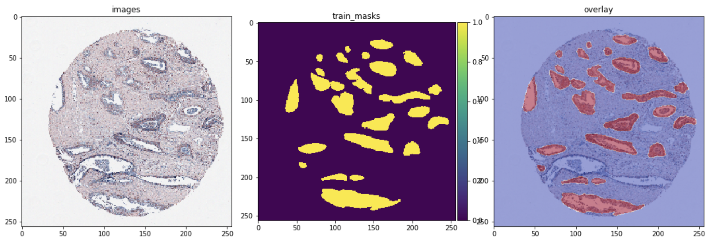

# HuBMAP
Image Segmentation with attention residual unet

# This notebook trains and compares three different U-Net models for segmentation tasks:

- U-Net: A classic U-Net architecture for image segmentation.
- Attention U-Net: A U-Net model with an attention mechanism integrated into the architecture, which helps the model focus on relevant regions for better segmentation results.
- Residual Attention U-Net: A U-Net model with both attention mechanism and residual connections. The attention mechanism helps the model focus on important regions, while residual connections improve the flow of information between layers and help the model learn deeper features.
## The following configurations are used for model training:
- Image dimensions and channels are determined based on the input data.
- A batch size of 8 is used for training.
- Adam optimizer with a learning rate of 1e-2 is used for optimization.
- Binary focal loss is used as the primary loss function.
- Dice coefficient is used as a metric for evaluation.
## The training process includes the following callbacks:
- ModelCheckpoint callback: Saves the best model based on the highest validation dice coefficient.
- EarlyStopping callback: Stops training if the validation loss doesn't improve for three consecutive epochs.
- CSVLogger callback: Saves the training history to a CSV file.
- Each model is trained for 20 epochs, and the execution time is calculated and printed for each model. The performance of the three models is compared, and the best performing model is selected based on the results.
